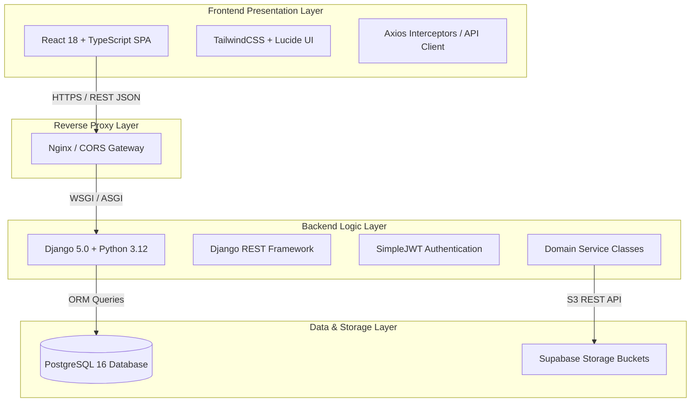
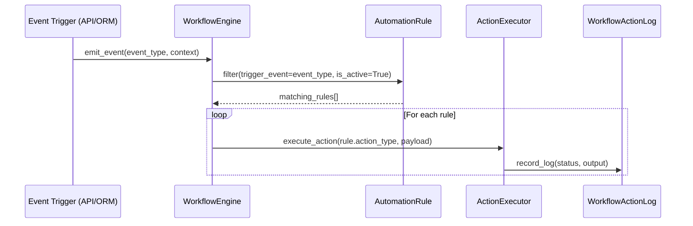

# Horizon ERP + ODEL Suite — Master Software Architecture Summary

**Generated Date:** June 30, 2026  
**Scope:** Enterprise system architecture, technology stack, subsystem interactions, and folder structure.

---

## 1. Project Overview & Technology Stack

Horizon is a decoupled enterprise web application engineered to unify physical institutional management with advanced hybrid e-learning (ODEL).



### Core Technology Stack
* **Frontend:** React 18, TypeScript, Vite, TailwindCSS, React Router v6, Lucide Icons, Axios.
* **Backend:** Python 3.12, Django 5.0, Django REST Framework (DRF), SimpleJWT.
* **Database:** PostgreSQL 16 (111 relational tables indexed with Django ORM).
* **Cloud Storage & Media:** Supabase Object Storage (S3-compatible bucket storage).

---

## 2. Subsystem Architecture

### A. Authentication & RBAC Flow
Security is governed by stateless JWT access tokens ($60$ min lifespan) paired with refresh tokens ($7$ days). User profiles map directly to one of $7$ immutable roles (`STUDENT`, `TEACHER`, `ADMIN`, `ACCOUNTANT`, `REGISTRAR`, `ADMISSIONS`, `HR`), strictly enforced by custom DRF permission classes (`IsAdminRole`, `IsTeacherRole`, `RoleProtectedRoute`).

### B. Enterprise Workflow Engine
The automation engine operates on an event-driven observer architecture:


### C. Finance & Accounting Architecture
Double-entry financial consistency is maintained through centralized accounting transaction wrappers. Whenever a `Payment` is created or synced via M-Pesa IPN, an immutable `StudentLedger` credit record is inserted, auto-allocating against outstanding invoices and generating a verifiable `Receipt`.

### D. Open Distance & e-Learning (ODEL) & Virtual Classrooms
The ODEL engine structures asynchronous curricula (`Course` $\rightarrow$ `Subject` $\rightarrow$ `Unit` $\rightarrow$ `Module` $\rightarrow$ `Lesson`). For synchronous classes, `VirtualClassroomService` schedules external Zoom/BBB meetings, logs telemetry packets via `VirtualAttendanceLog`, and automatically writes back `Present`/`Late` marks into physical SIS `Attendance` ledgers when duration thresholds are met.

### E. AI Assistant & RAG Knowledge Engine
The AI Coach uses a Retrieval-Augmented Generation (RAG) pattern. User inquiries trigger embedding lookups against stored `KnowledgeDocument` vectors before synthesizing contextual pedagogical or institutional responses.

---

## 3. Project Folder Structure

```
edify-hub/
├── backend/                        # Django REST Backend
│   ├── apps/                       # Domain Modules (19 Apps)
│   │   ├── academics/              # SIS Structure, VirtualClass, Telemetry
│   │   ├── accounts/               # User Models & RBAC Auth
│   │   ├── ai_assistant/           # German AI Coach & Vector Knowledge Base
│   │   ├── analytics/              # Executive BI & C-Suite Command Center
│   │   ├── attendance/             # Institutional Physical Attendance Ledger
│   │   ├── audits/                 # System-wide Immutable Audit Logs
│   │   ├── certificates/           # Tamper-Evident Certificate Engine
│   │   ├── communication/          # Messaging Hub, Broadcasts & Notifications
│   │   ├── core/                   # Public Verification & Shared Base Models
│   │   ├── dms/                    # Document Management & Supabase Telemetry
│   │   ├── finance/                # Fee Structures, Invoicing, Ledgers & M-Pesa
│   │   ├── hr/                     # Staff Profiles, Payroll & Leave Management
│   │   ├── library/                # Digital & Physical Library Assets
│   │   ├── notifications/          # Push & In-app Alert Center
│   │   ├── odel/                   # LMS Curricula, Formal Exams & AI Coach Services
│   │   ├── results/                # Academic Gradebooks & Marks Entry
│   │   ├── students/               # Student Profiles & Admissions Pipeline
│   │   └── workflows/              # Event-Driven Automation Engine
│   ├── config/                     # Django URL Routing & Project Settings
│   ├── seed_german_platform.py     # CEFR Catalog & ODEL Seeder Script
│   └── verify_odel_german.py       # Automated Verification Diagnostic Suite
├── src/                            # React TypeScript Frontend
│   ├── components/                 # Reusable UI & Shell Layouts
│   ├── layouts/                    # Role-Based Navigation & Sidebar Config
│   ├── pages/                      # Application Pages (47 Pages)
│   │   ├── app/                    # Authenticated Portal Pages (31 Pages)
│   │   ├── auth/                   # Login & Password Recovery (7 Pages)
│   │   └── dms/                    # Document & Storage Management (3 Pages)
│   ├── services/                   # Frontend API Clients (Axios Wrappers)
│   ├── routes/                     # Protected Route Guards & AppRoutes
│   └── types/                      # TypeScript Domain Interfaces
└── package.json                    # NPM Dependencies & Build Scripts
```
