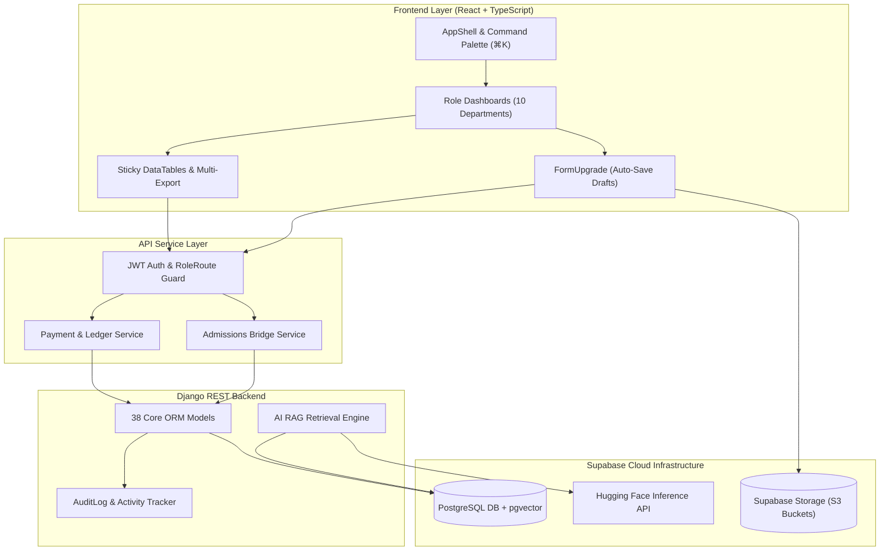

# Horizon ERP & ODEL — System Architecture Report

**Date:** June 27, 2026  
**Architecture Style:** Decoupled Modular Monolith + RAG AI Layer  

---

## Architectural Overview

Horizon ERP combines a high-performance React frontend (Vite/Tailwind CSS/Radix UI) with a robust Django REST Framework backend backed by Supabase PostgreSQL and S3-compatible file storage.

---

## Module Interaction Diagram

---

## Key Subsystem Integrations

1. **Admissions Bridge:** Connects public applicant inquiries directly into the SIS student table upon verification.
2. **Finance & Ledger Reconciliation:** Automates the allocation of M-Pesa transactions against billing invoices.
3. **AI RAG Assistant:** Ingests document embeddings from Supabase S3 into `pgvector` to provide conversational answers about German course rules and Goethe exams.
