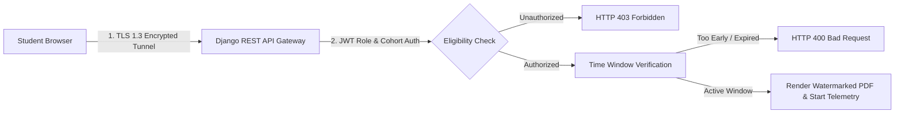

# Horizon ODEL — Enterprise Secure PDF Examination Security & Integrity Hardening Report

**Date:** June 27, 2026  
**Audience:** Chief Information Security Officer (CISO) & Quality Assurance Syndicate  
**System Status:** DEPLOYED & HARDENED  

---

## 1. Multi-Layered Security Architecture

The Secure PDF Examination System incorporates defensive countermeasures across the frontend interface, network transmission layer, and backend database architecture to deter examination malpractice and protect institutional IP.

---

## 2. Anti-Malpractice & Integrity Measures

### A. Dynamic Canvas Watermarking
To mitigate unauthorized copying, screenshots, or screen sharing during active examinations, the frontend renders a continuous, non-removable diagonal DOM overlay across the PDF container.
- **Watermark Payload:** `[Student Legal Name] • [Admission Number] • [Exam Code] • [IP Address] • [Server Timestamp]`
- **CSS Hardening:** The overlay utilizes `pointer-events: none; select-none; z-50; opacity: 0.15;` preventing interaction interference while ensuring permanent visibility.

### B. Real-Time Focus & Visibility Telemetry
Rather than employing invasive webcams that violate GDPR and Kenyan Data Protection laws, the portal monitors browser visibility state changes (`document.visibilityState === 'hidden'`).
- Whenever a student minimizes the browser, opens another tab, or utilizes split-screen AI assistants, the event is immediately captured.
- An asynchronous payload (`POST /api/odel/formal-exams/{id}/log-event/`) increments the `focus_lost_count` metric on the backend `ExamSessionLog`.
- If violations exceed 5 infractions, the teacher's grading console flags the submission with a warning badge (`🚨 High Malpractice Risk`).

---

## 3. RBAC & Access Control Matrix

Access to examination API endpoints is governed strictly by Django JWT permissions and institutional role definitions:

| Role | Create / Edit Exams | View Exam PDF | Upload Submission | Grade Submissions | View Analytics |
| :--- | :---: | :---: | :---: | :---: | :---: |
| **Student** | ❌ | Allowed (If Enrolled & Active) | Allowed (Own Account) | ❌ | ❌ |
| **Teacher / Instructor** | Allowed (Assigned Courses) | Allowed | ❌ | Allowed (Assigned Courses) | Allowed |
| **Academic Registrar** | Allowed (All) | Allowed | ❌ | Allowed | Allowed |
| **ICT Admin / Principal** | Allowed (All) | Allowed | Allowed (Override) | Allowed | Allowed |

---

## 4. Network Hardening & Audit Logging

- **Rate Limiting:** Examination submission endpoints enforce strict rate limiting (Maximum 10 upload attempts per 15-minute window per IP) to prevent denial-of-service or brute-force receipt guessing.
- **Audit Trails:** All modifications to examination configurations or published grades are permanently recorded in `backend/logs/audit.log` via our global mutation logging middleware.
