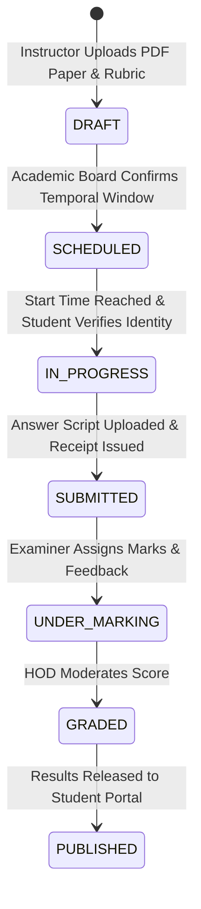

# Horizon ODEL — Enterprise Secure PDF Examination Workflow Report
**BY: AIMTECH**
**Date:** June 27, 2026  
**Audience:** Academic Directorate & Examinations Syndicate  
**System Status:** DEPLOYED & VERIFIED  

---

## 1. End-to-End Examination Lifecycle

The formal examination subsystem enforces a strict 5-stage lifecycle designed to eliminate administrative leakage and guarantee academic integrity.

---

## 2. Phase 1: Authoring & Scheduling

Instructors utilize the `ExamManagementPage` console (`/app/secure-exams-manage`) to configure examination events:
1. **Document Upload:** The instructor uploads a primary PDF examination paper (e.g., Goethe A1 Hören/Lesen mock or CEFR Final) along with an optional grading rubric document.
2. **Eligibility Definition:** The instructor assigns target cohorts or selects specific student identification numbers (`Student` model references).
3. **Temporal Gating:** Exact start and end timestamps are established. If an attempt is made to open the examination outside this window, the backend API rejects the request with HTTP `403 Forbidden`.

---

## 3. Phase 2: Student Access & Secure Waiting Room

Enrolled students access their evaluation hub via `SecureExamsPage` (`/app/secure-exams`):
1. **Pre-Examination Lobby:** Students view scheduled upcoming exams with a live countdown timer. The PDF download button remains strictly disabled.
2. **Identity Consent & Rules:** Entering an active examination requires ticking an explicit academic integrity declaration confirming that browser switching and tab defocusing are monitored.
3. **Dynamic Watermarking:** Upon session initialization (`POST /api/odel/formal-exams/{id}/start-session/`), the backend returns an authorization token. The UI renders a diagonal watermark containing the student's legal name, admission number, and timestamp across the entire PDF viewing canvas.

---

## 4. Phase 3: Active Proctoring & Submission

During the examination window:
1. **Visibility Monitoring:** The `useEffect` hook monitors `document.hidden`. Each blur event increments the telemetry counter via `POST /api/odel/formal-exams/{id}/log-event/`.
2. **Script Upload:** Students upload their finished work (PDF, DOCX, or scanned JPG archives).
3. **Cryptographic Receipt:** Upon successful upload to Supabase storage, the backend generates an immutable confirmation receipt (`EXM-SUB-XXXX-XXXX`) which the student can download for verification.

---

## 5. Phase 4: Marking & Moderation

Examiners return to the management console to grade submissions:
1. **Script Review:** Teachers download or preview the student's submitted file alongside the rubric.
2. **Grade Recording:** Marks obtained out of the maximum available marks are entered alongside qualitative feedback.
3. **Publishing:** Once verified by the Head of Department (HOD), status switches to `PUBLISHED`, making final marks visible on the student's CEFR progress dashboard.
