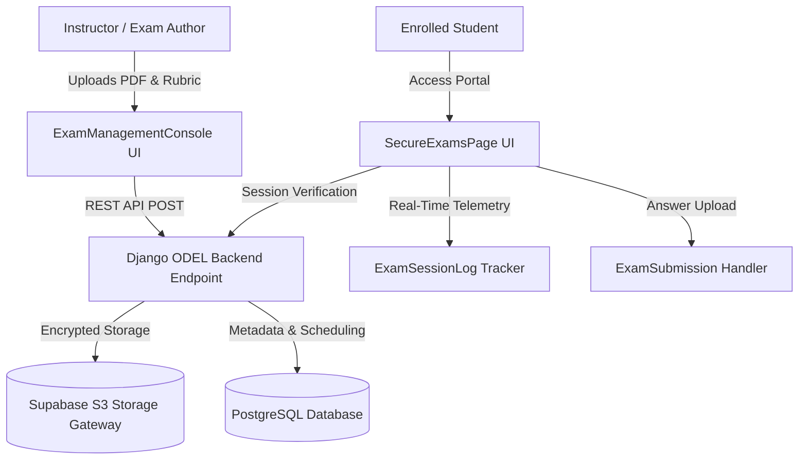

# Horizon ODEL — Enterprise Secure PDF Examination Architecture Report

**Date:** June 27, 2026  
**Audience:** Academic Board & Technical Architecture Committee  
**System Status:** DEPLOYED & VERIFIED  

---

## 1. Architectural Overview

The Horizon ODEL Enterprise Secure PDF Examination System introduces a dedicated, high-stakes formal assessment subsystem bridging offline authoring workflows with encrypted online distribution. Designed specifically for Goethe-Zertifikat mock examinations, CEFR level progression tests, and formal end-of-term evaluations, the architecture ensures complete separation between casual self-assessment interactive quizzes and strictly regulated examination papers.

---

## 2. Core Data Models

The system architecture extends the existing Django `odel` app with three enterprise-grade relational models:

### A. `OfficialExamination`
Serves as the master registry for formal PDF-based examination papers.
- **Academic Classification:** Links directly to `Course`, `Level` (A1–C2 CEFR), `Module`, `Semester`, and `AcademicYear`.
- **Exam Types:** Configured via enumerated types (`GOETHE_MOCK`, `MIDTERM`, `FINAL`, `CEFR_PLACEMENT`).
- **Access Control:** Employs explicit Many-to-Many student eligibility mappings (`eligible_students`) alongside strict temporal gating (`start_time`, `end_time`, `duration_minutes`).
- **Policy Enforcement:** Defines automated late rules (`ALLOW_LATE`, `PENALTY`, `REJECT`).

### B. `ExamSessionLog`
Provides high-fidelity audit telemetry capturing student interaction during active examination windows.
- **Lifecycle Tracking:** Records precise timestamps for session initialization, PDF rendering, and document downloading.
- **Integrity Telemetry:** Logs browser visibility changes (`focus_lost_count`), connection dropouts (`connection_interruptions`), and device IP metadata.

### C. `ExamSubmission`
Tracks the complete grading lifecycle of uploaded student answer scripts.
- **Cryptographic Receipt:** Generates an immutable tracking receipt string (`EXM-SUB-...`) upon upload completion.
- **Grading Pipeline:** Transitions through structured marking states (`SUBMITTED` $\rightarrow$ `UNDER_MARKING` $\rightarrow$ `GRADED` $\rightarrow$ `PUBLISHED`).

---

## 3. Integration with Core Horizon ERP

The examination subsystem integrates seamlessly with existing Horizon institutional modules:
1. **Admissions & Student Records:** Automatically verifies student enrollment and fee clearance status before unlocking secure examination waiting rooms.
2. **Academic Transcript Engine:** Final published scores automatically aggregate into the student's CEFR academic record.
3. **Storage & Audit Services:** Leverages universal Supabase buckets and backend audit middleware for tamper-evident activity logging.
